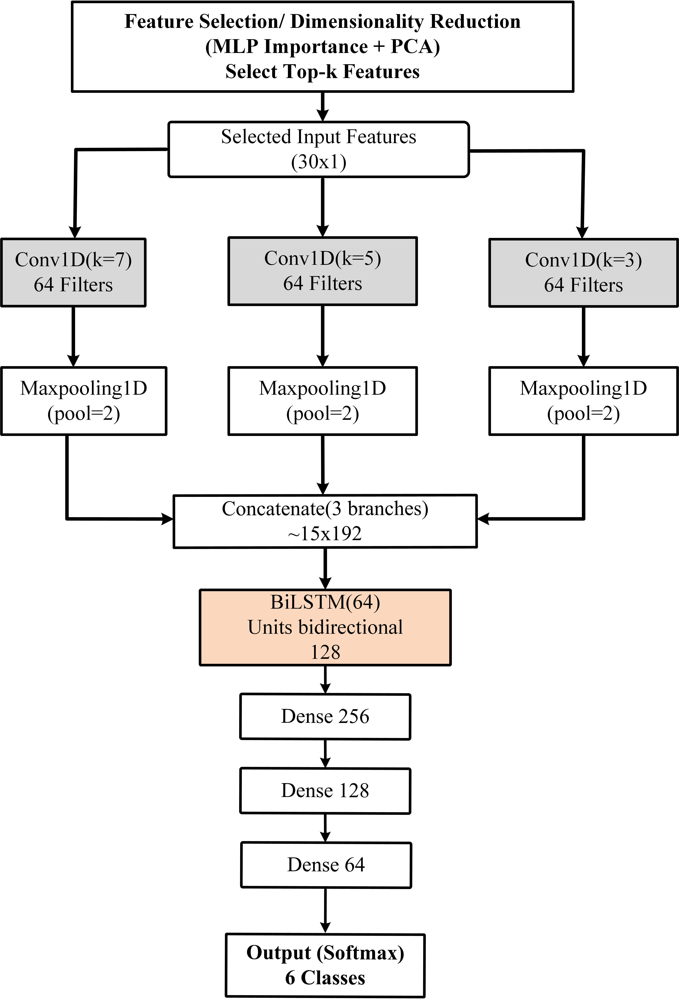

# A Lightweight Multi-Scale Deep Learning Approach for Robust Photovoltaic Fault Detection Under Noisy Conditions

## Overview
This repository contains the implementation and supporting resources for a photovoltaic (PV) fault-detection study based on **BLGSNet**, a lightweight hybrid deep-learning architecture designed for robust fault classification under noisy operating conditions.

BLGSNet integrates parallel multi-scale one-dimensional convolutional branches with a bidirectional long short-term memory (BiLSTM) network. The convolutional branches capture local fault patterns at different scales, while the BiLSTM models bidirectional contextual relationships across ordered PV features. The model is trained using all 30 standardized input features. MLP-based permutation ranking and principal component analysis (PCA) are additionally used to analyse feature relevance and construct compact representations for comparisons with conventional machine-learning methods.

## Main Contributions
- A compact BLGSNet architecture is developed for six-class PV fault diagnosis using three parallel Conv1D branches and a single BiLSTM layer for bidirectional contextual modeling across the ordered feature representation, providing a simplified alternative to recently reported attention-intensive multi-scale CNN-BiLSTM architectures.

- BLGSNet is trained using all 30 standardized PV features,
    while MLP-based permutation ranking and PCA are employed to analyse
    feature relevance, redundancy, and compact feature representations
    for conventional machine-learning comparisons.

- The robustness of the proposed model is evaluated under
    noise-free conditions and under composite Gaussian, bias, and
    impulsive perturbations at 10% and 15% noise levels.

- An additional experimental PV dataset is used to examine model
    transferability under practical operating variability, with the
    limitation that its fault labels are generated using rule-based
    pseudo-labelling rather than manually verified maintenance records.

- A rule-based maintenance decision-support module translates
    the predicted fault class and confidence into predefined severity
    levels, maintenance priorities, probable causes, and recommended
    inspection actions.

-  A laboratory-scale edge implementation using an NVIDIA Jetson
    Nano and a real-time monitoring dashboard demonstrates online
    diagnosis of string-fault, partial-shading, and component-related
    operating conditions at 96.36% accuracy.

## Methodology

  

## Contact
Ijaz Ahmad Khan (Kookmin University, Seoul South Korea), Email: ajislamian@gmail.com
